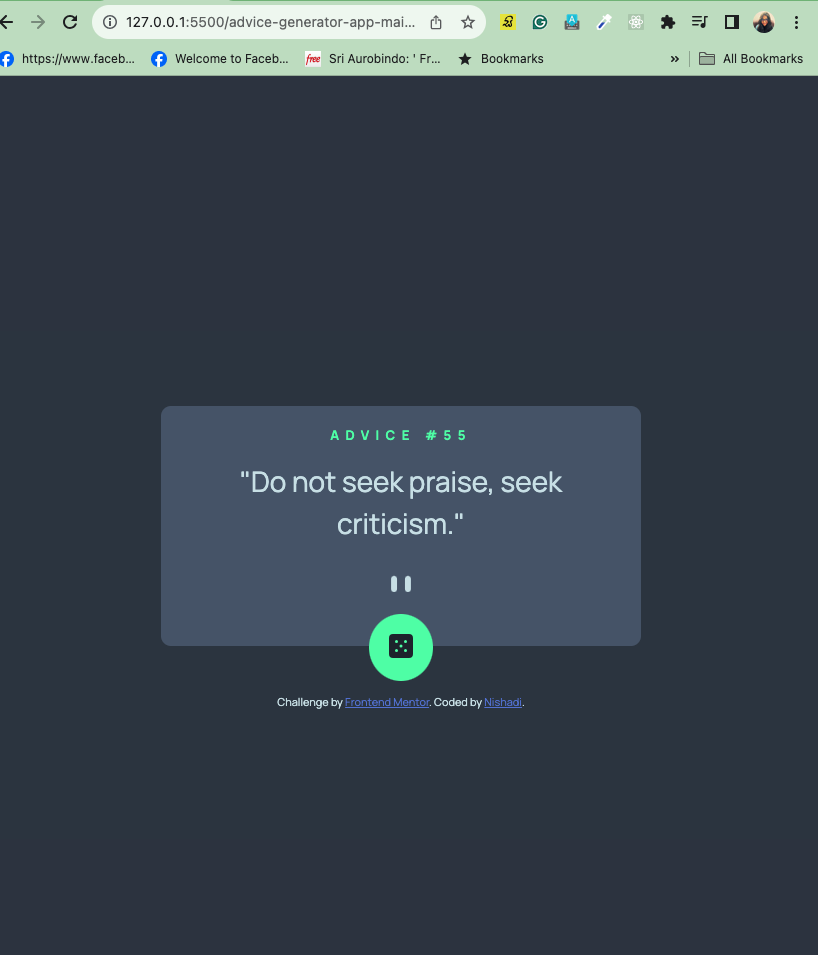

# Frontend Mentor - Advice generator app solution

## Table of contents

## Overview

### The challenge

Users can:

- View the optimal layout for the app depending on their device's screen size.
- See hover states for all interactive elements on the page.
-  Generate a new piece of advice by clicking the dice icon.

### Screenshot

### Links

- Solution URL: [Add solution URL here](https://your-solution-url.com)
- Live Site URL: [Add live site URL here](https://your-live-site-url.com)

## My process

### Built with

- Semantic HTML5 markup
- CSS custom properties
- Flexbox
- CSS 
- Vanilla JavaScript

### Continued development

I plan to continue refining my JavaScript skills and exploring more advanced features. Additionally, I aim to enhance the app's accessibility and add more interactive features.

### Useful resources

Mozilla Developer Network (MDN) Web Docs - A comprehensive resource for web developers.
Frontend Mentor - Great challenges to practice and improve frontend skills.

## Author

Nishadi

## Acknowledgments

I'd like to thank Frontend Mentor for providing this challenging project, allowing me to apply and enhance my skills. Additionally, thanks to the supportive community for valuable feedback.

